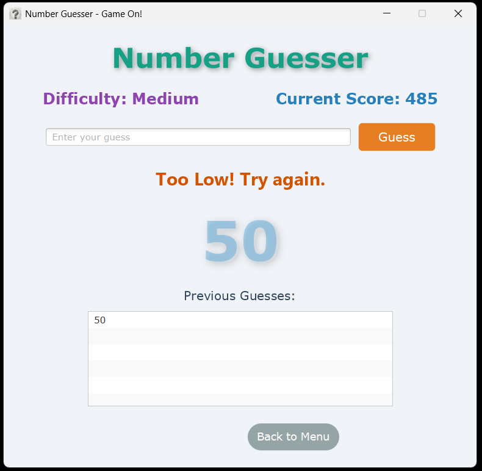

# Guess The Number JFX

A modern, user-friendly Number Guessing Game built with JavaFX.

## Repository: [MaliYilmaz34/GuessTheNumberJFX](https://github.com/MaliYilmaz34/GuessTheNumberJFX)

---

## 📸 Screenshots

| Login            | Welcome/Main Menu | Leaderboard      | Game             | Win              |
|------------------|------------------|------------------|------------------|------------------|
|  |  |  |  |  |

---

## 🎮 Features

- User registration and login
- Main menu navigation
- Number guessing gameplay with feedback
- Leaderboard with user scores
- Responsive and consistent UI layout
- Sound effects for hints and wins
- Persistent user data storage

---

## 🗂️ Project Structure

```
GuessTheNumberJFX/
├── screenshots/           # App screenshots (login.png, welcome.png, leaderboard.png, game.png, win.png)
├── src/                   # Java source code and resources
│   └── main/
│       ├── java/
│       └── resources/
├── pom.xml                # Maven build file
└── README.md              # Project documentation
```

---

## 🚀 Getting Started

### Prerequisites
- Java 17 or higher
- JavaFX
- Maven

### Build & Run

1. **Clone the repository:**
   ```sh
   git clone https://github.com/MaliYilmaz34/GuessTheNumberJFX.git
   cd GuessTheNumberJFX
   ```
2. **Build the project:**
   ```sh
   mvn clean install
   ```
3. **Run the application:**
   ```sh
   mvn javafx:run
   ```

---

## ⚙️ Configuration
- User data is stored in `users.json` in the project root.

---

## 🤖 AI Usage Disclaimer

> **Disclaimer:** This project was written by the help of AI.

---

## 📄 License
This project is licensed under the MIT License.
